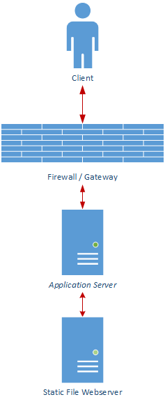

# App Code as Proxy
---

This is a proof of concept application that demonstrates how one can use a web application to proxy requests to a back-end static file server. This is done to enable the use of better access control over these static files.

# To run:
* To run in foreground: `> docker-compose up`
* To run in background: `> docker-compose up -d`
* To stop from background: `> docker-compose down`
* To rebuild and run: `> docker-compose up --build`
  * Use this if you make changes to the code 
* Application will be accessible on port 8080
